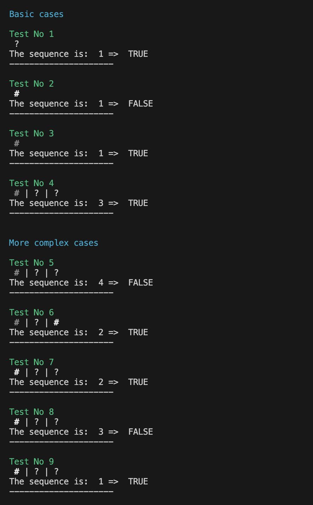
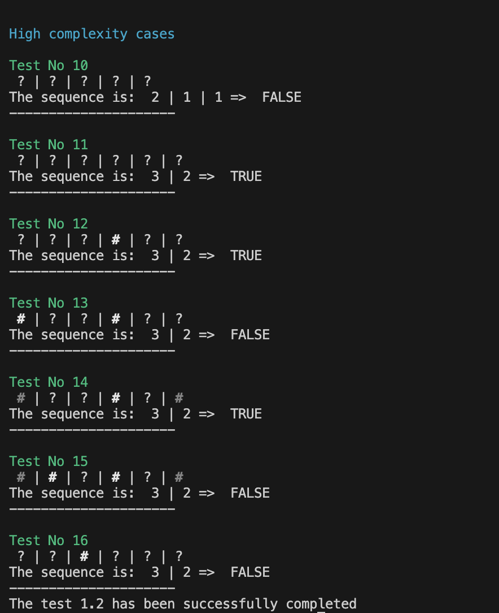

# Projet Vasileios Skarleas et Yanis Sadoun

## Question 1

Si l'on a calculé tous les (T(j, l), pour savoir s'il est possible de colorier la ligne li entière avec la séquence entière, il suffit de regarder la valeur de T(M-1, k) avec k entre 1 et l. Il faut noter que M représente le nombre total de colonnes dans la ligne en question.

La valeur de T(M-1, k) nous indique s'il est possible de placer le k-ième bloc dans la ligne de manière à ce que tous les blocs \( s_1, s_2, ..., s_k \) soient placés correctement selon les règles du jeu. En revanche, si T(M-1, k) est vrai, cela signifie qu'il y a une façon de colorier toute la ligne en respectant les contraintes des séquences de blocs noirs.

Maintenant qu’on sait qu’on peut colorier toute la ligne, il faut prouver que c’est la seule solution. La condition de l’unicité est T(M-2,k) est FALSE qui veut dire que pour une indice avant l'indice maximale des colones pour laquelle on a la condition verifié, on regarde qu'il faut avoir comme reponse egale à faux parce que normallement il n'y a pas de cases suffisantes pour que cette condition est aussi correct.

## Question 2

Les cas de base de l'algorithme récursif pour remplir la table **T(j, l)** sont essentiels pour établir les conditions initiales qui vont guider la construction de la solution. Selon les conditions du jeu on a:

* Case 1

  * Dans ce cas, il n'y a aucun bloc noir à placer, donc peu importe la valeur de  **j** , la ligne peut toujours être colorée en blanc jusqu'à la case  **j** . Cela signifie que pour  **l = 0** , tous les **T(j, 0)** sont vrais, car une séquence vide est toujours possible.
  * Ainsi, il faut retourner toujours TRUE.
* Case 2

  * Option a (j < sl − 1)

    * Si j est inférieur à  sl - 1, cela signifie que l'espace disponible est insuffisant pour le premier bloc de taille sl . Dans ce cas, il n'est pas possible de placer un bloc de taille **sl** dans les j+1 premières cases.
    * Alors il va retourner toujours FALSE cette cas
  * Option b (j = sl − 1)

    * Si j est égal à  sl - 1 , cela signifie que l'espace disponible est juste suffisant pour placer le premier bloc de taille sl et rien d'autre. Dans ce cas, le coloriage est possible si et seulement si l = 1.
    * Ainsi il va retourner TRUE si on est à s1 parce que on sait forcement qu'il n'y a pas une autre sequence à traiter. Par contre pour sl, si l > 1, alors on ne peut pas être sur si la prochaine sequence pourrait etre traité de debut à la fin.

## Question 3

Soit j' < j et l' <= l. On propose la recurence suivante:

* Si (i, j) est blanc alors T(j, l) = T(j - 1, l)
* Si (i, j) est noir alors T(j - sl -1, l - 1)

**Si la case ((i,j) est blanche :** Cela signifie que la configuration qui termine à la case ((i,j−1) doit déjà être valide pour les blocs. Donc, T(j,l) est vrai si T(j−1,l) est vrai.
**Si la case (i,j) est noire :**  nous voulons vérifier si le bloc de sl cases noires peut se terminer à la case  j, donc nous devons regarder sl cases avant la case  j et aussi compter une case supplémentaire pour l'espace blanc obligatoire. Cela signifie que nous regardons à la position j − sl − 1 . Si T ( j − sl − 1 , l − 1 )  est vrai, cela signifie qu'il est possible de placer les l − 1  premiers blocs dans les premières j − sl − 1  cases, ce qui laisse juste assez d'espace pour que le bloc sl soit placé à la fin.

On applique tous ceux notions sur le pseudocode proposé ci-dessous pour la question 4.

## Question 4

```python
bool T(l, j, tab, seq)
Entree: indice de collogne j, indice de la sequence l, addresse du tableau des lignes, addresse du tableau des sequences

si (l = 0) alors
	retourner TRUE
finsi
si (l >= 1) alors
	si (j < seq[l] -1) alors
		retourner false
	finsi
	si (j = seq[l] - 1) alors
		si (l = 1) alors
			retourner true
		sinon
			retiurner false
		finsi
	finsi
	si (j > seq[l] - 1) alors
		si (T(l, j-1, tab, seq) || T(l-1, j - seq[l] - 1, tab, seq)) alors
			retourner true
		sinon
			retourner false
		finsi
	finsi
finsi
```

Trouver la fonction finale selon les modifications demandé en question 5 à la question 7.

## Question 5

On propose les modifications suivantes:

1. Dans le cas 2b, on verifie si on trouve une case blanche pour l'intervalle de 0 à j-1. Si une telle case existe alors automatiquement la sequence en question n'est pas valable, ainsi on retourne false. Sinon si ce premier test est passé, on a retourne true si et seulemt si l = 1 comme avant.
2. Dans le cas 2c, on regarde si la case tab[j] est blanche. Si c'est le cas, il faut qu'on se deplace une position à gauche `T(j - 1, l, tab, seq)` et on re-test. Si ce n'est pas le cas, on dans une de deux cas ci-dessous:

   * Soit la case est noir
   * Soit la case n'est pas colorié

   Alors on continue d'appeler recursivement selon la relation de recurssion trouvé à la question 3.

## Question 6

La complexité de la fonction T dépend de la façon dont les appels récursifs se déroulent. Dans le pire des cas, on peut observer une complexité exponentielle parce que :

* Cas de base : Si la longueur de la séquence l est nulle, la fonction retourne `true` - complexité O(1).
* Cas récursifs :

  * Si la position courante j est inférieure à la valeur attendue selon la séquence, la fonction retourne `false` O(1).
  * Si j correspond à la fin d'un élément de la séquence, la fonction parcourt les cases de 0 à j-1. Ce parcours peut aller jusque à M éléments dans le pire des cas, ce qui représente une complexité de O(M).
  * D'autre cote, si j dépasse la fin d'un élément de la séquence, la fonction effectue deux appels récursifs, pouvant mener à une situation où chacun de ces appels en déclenche deux autres, et ainsi de suite. Cette situation crée une arborescence d'appels qui grandit de manière exponentielle par rapport à M

  Ainsi la complexité globale est O(2^M)

Effectivement, il y a des scenarios ou l'algorithme finis plus rapidement que prevu, par exemple:

* Si la boucle dans le deuxième cas récursif rencontre une case blanche (`WHITE`), la fonction retourne `false` immédiatement, stoppant la recursion sur cette branche.
* Si la longueur de la séquence l possède une borne supérieure constante (indépendante de M), la profondeur de la recursion sera limitée, pouvant mener à une complexité inférieure.

## Question 7

### L'algorithme

```c
bool T(int j, int l, int *tab, int *seq)
{
    if (l == 0)
    {
        return true;
    }
    if (l >= 1)
    {
        if (j < seq[l-1] - 1) // please consider that is seauence seq the place at seq[0] is never used on our program. It's just initialises on a nunber that we never take into consideration
        {
            return false;
        }
        if (j == seq[l-1] - 1)
        {
            //checking for any whites on this space
            for (int i = 0; i <= j; i++)
            {
                if (tab[i] == WHITE)
                {
                    return false;
                }
            }
            return (l == 1); //the condition that needs to be true in order for that sub case (2b) to be verfied
        }
        if (j > seq[l-1] - 1)
        {
            //Checking if it white as mentioned on Project's subject
            if (tab[j] == WHITE && T(j - seq[l-1] - 1, l - 1, tab, seq)) // we check the previous combination [I AM NOT SURE FOR THE SECOND CONDITION]
            {
                return (T(j - 1, l, tab, seq));
            }
            return (T(j - 1, l, tab, seq) || T(j - seq[l-1] - 1, l - 1, tab, seq));
        }
    }
    return false;
}
```

### Tests

On propose les tests ci-dessous:





## Question 8

Let's see
