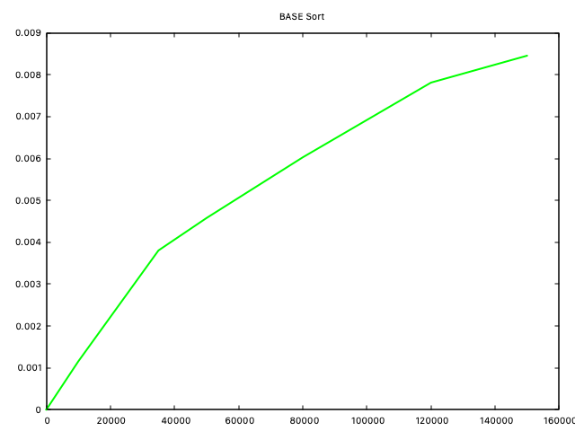

# TP1

## Exercice 2

### Complexité:

La compléxité de l'agorithme tri_insertion est O(n^2)


### Explication:

Selon le code en C et les notions théoriques on a:

```c
void tri_ins(int *tab, int n)
{
  int key, index; //O(1)
  for (int i = 1; i < n; i++) //n x (O(1)+O(1)+O(n))
  {
    key = tab[i]; //O(1)
    index = i - 1; //O(1)
    while (index >= 0 && tab[index] > key) //n x O(1)
    {
      tab[index + 1] = tab[index]; //O(1)
      index--; //O(1)
    }
    tab[index + 1] = key; //O(1)
  }
} 
// => (n x O(n)) + O(1) = O(n^2)
```

## Exercice 3

### Complexité:

La compléxité de l'algorithme tri_fusion est O(n log(n))


### Explication:

L’algorithme de tri fusion utilise une stratégie classique dite « diviser pour régner ». Elle consiste en découper un gros problème en plus petits problèmes, résoudre récursivement les problèmes, puis combiner les résultats pour obtenir une solution au problème initial.

En ce qui concerne l'analyse de complexité on observe ci-dessous l'arbre des appels recursifs:

Le coût d’un nœud est simplement le coût de la séparation et de la fusion. Si l'on regarde les coûts par niveau, on se rend compte que le premier niveau est O(n), le deuxième deux fois 0(n/2), le troisième quatre fois O(n/4), etc. Chaque niveau coûte donc O(n), où n est la taille de la séquence initiale, jusqu'au dernier niveau, où il y a 2k feuilles représentant le coût de « trier» des sous-séquences de taille 1, i.e., O(1), et 2k = n.

Au total, la complexité de l'algorithme du tri_fusion est O(n) x le nombre de niveaux, c'est-à-dire la hauteur de l'arbre. Comme pour la recherche binaire, on trouve que cette hauteur est exactement le nombre de fois qu'il faut diviser n par 2 pour atteindre 1, soit k = log n. La complexité du tri fusion est donc en O(n log(n)).

### Selon le théorème maitre:

Considérons la relation de récurrence qui viens du théorème maitre:


où a, b et c sont des réels positifs, avec a > 1 et b > 1. Alors :

1. Si c < logb a : C(n) = Θ(n^logb(a))
2. Si c > logb a : C(n) = Θ(n^c)
3. Si c = logb a : C(n) = Θ(n^(logb(a)) * log(n))

Dans notre cas:

`T(n) = 2T(n/2) + O(n)` selon tri_fusion_bis. Alors, a = 2, b = 2 et *f* (n) = O(n). On remarque ainsi que l'on est dans le cas numéro 2. Ainsi n^log b(a)  <=> O(n) et n^1 <=> O(n), dès lors T(n) = O(n log(n)).

## Exercice 4

Pour cette exercice , on a écrit deux versions differentes de la même base d'algorithme d'énumeration. L'un , (tri_enum_v2), utilise le min et le max du tableau passé en argument et l'autre, (tri_enum), utilise un traitment lineaire selon le numero de fois ou on utilise  l'élement trouvé sur le tableau original, tout en calculant la nouvelle position via:

```c
for (int i = n - 1; i >= 0; i--) // We start from the end and we go back to the beginning
  {
    int position = counts[tab[i]] - 1;
    sorted[position] = tab[i]; // placing the element on the final position that was found beforehand
    counts[tab[i]]--;          // in case that we have more times the same item in the table, we need to increment
    // the number_of_times that we saw it in order to be placed on the correct position (otherwise we
    // would place it always on the same position and that would have no effect on sorting)
  }
```

### Complexité

#### tri_enum

La compléxité de l'algorithme tri_enumeration est O(n + key)


#### tri_enum_v2

La compléxité de l'algorithme tri_enum_v2 est O(n + key)


**Nota bene:** Ici la version 2 s'emble être la plus efficace (elle traite les cas négatives)

### Explication

#### tri_enum

```c
void tri_enum(int *tab, int n)
{
  int key = tab[0]; //O(1)
  get_max(tab, n, &key); //O(n)

  int counts[key + 1]; //O(1)
  for (int i = 0; i <= key; i++) //key x O(1) => O(key)
  {
    counts[i] = 0; // O(1)
  }

  for (int i = 0; i < n; i++) //n x O(1) => O(n)
  {
    counts[tab[i]]++; //O(1)
  }

 
  for (int i = 1; i <= key; i++) //key x O(1) => O(key)
  {
    counts[i] += counts[i - 1]; // O(1)
  }

  int sorted[n]; //O(1)
  for (int i = n - 1; i >= 0; i--) // n x 3 x O(1) => O(n)
  {
    int position = counts[tab[i]] - 1; //O(1)
    sorted[position] = tab[i]; // O(1)
    counts[tab[i]]--;          // O(1)
  }

  for (int i = 0; i < n; i++) //n x O(1) => O(n)
  {
    tab[i] = sorted[i]; //O(1)
  }
}
```

Donc au total on a `O(1) + O(n) + O(1) + O(key) + O(n) + O(key) + O(1) + O(1) + O(n) + o(n) => O(n + k)`

#### tri_enum_v2

Si Bmax et Bmin sont des constantes, c'est-à-dire que la différence entre ces deux valeurs ne change pas et ne dépend pas de la taille du tableau n, la complexité de l'algorithme de tri par énumération change de manière significative. Dans notre algorithme:

* `get_min_max` a une complexité de O(n)
* On a deux boucles imbriquées (une boucle  pour de compléxité (O(n)) et une boucle tant que de compléxité (O(k))) .Ainsi, ils  ont une complexite de O(n)

Donc au total on a `O(n) + O(n + k) => O(n + k)`

### Comparaison

La complexité du tri par énumération est O(n + k), où n est le nombre d'éléments et k est l'intervalle des valeurs. Lorsque k est relativement petit (c'est-à-dire lorsque les éléments à trier sont dans un petit intervalle), cette complexité peut être considérée comme linéaire, ce qui en fait un algorithme très rapide.

À contrario, les autres méthodes, comme le tri par insertion (O(n²)), le tri fusion (O(n log n)), et le tri de base (O(d*n) où d est le nombre de chiffres), ont généralement des complexités plus élevées, surtout dans le cas de grands ensembles de données (ici ils pouraient être plus efficaces par rapport au tri par énumération).

## Exercice 5

### Complexité

La compléxité de l'algorithme tri_base est O(n x max_length) avec max_length = longeur_du_numero_maximum_du_tableau



### Explication

De  prime abord , la complexité du code semble être O(n^2) mais il faut essayer d'aller un peu plus loin. Elle itère en fonction du nombre maximum de chiffres dans n'importe quel élément `max_len` (maximum length). Il est vraie q'il y a trois boucles imbriquées, chacune itérant n fois mais ces boucles là ne sont pas imbriquées directement les unes dans les autres.

En fait la complexité semble être O(n x max_length), mais il faut noter que le nombre de chiffres dans le plus grand élément (`max_len`) est relativement petit par rapport au nombre total d'éléments n.

### Comparaison

On constate que cet algorithme est plus rapide que le tri fusion pour les limites des données que nous avons testées. D'aprés la quéstion precedent: on sait que la complexité du tri fusion est en O(n log n), indépendamment de la nature des données. Cépendant, la complexité du tri de base est O(d*n), où d est le nombre de chiffres dans les nombres à trier. Pour des ensembles de données où d est relativement petit par rapport à n, cette complexité peut être vue comme linéaire, ce qui peut rendre le tri de base plus rapide que le tri fusion (d <log(n) dans ce cas là).

### Pour aller plus loin

On a constaté qu'il y avait une erreur `bus_error` lorsque qu'on utilisait des valeurs négatives. C'est pourquoi on a ajouté une fonction qui permet de traiter les valeurs negatives.

```c
void tri_base(int *tab, int n)
{
  int nb_negatives =0;
  for (int i = 0; i<n;i++)
  {
    if (tab[i]<0)
    {
      nb_negatives ++;
    }
  }
  int tab_negatives[nb_negatives];
  int tab_positives[n-nb_negatives];
  int i_n = 0, i_p =0;
  for (int i = 0; i < n; i++)
  {
    if (tab[i]<0)
    {
      tab_negatives[i_n] = -tab[i]; //absolute value that will be trated
      i_n++;
    }
    else 
    {
      tab_positives[i_p]=tab[i];
      i_p++;
    }
  }

  tri_base_bis(tab_negatives, nb_negatives);
  tri_base_bis(tab_positives, n-nb_negatives);

  i_p = 0;
  for (int i = nb_negatives-1; i >= 0; i--)
  {
    tab[i_p] = -tab_negatives[i]; 
    i_p++;
  }
  for (int i =0; i < n-nb_negatives; i++)
  {
    tab[i_p] = tab_positives[i];
    i_p++;
  }
}
```


## Exercice 6

La stratégie pour reponde au cahier des charges du jeu Horse-Racing Duals est la suivante:

* En parcourant le tableau trié du début à la fin, calculez la différence entre chaque élément et son successeur. La plus petite différence trouvée durant ce parcours est la différence la plus faible entre les puissances de deux chevaux.
* Une fois que le tableau est trié, les puissances des chevaux sont organisées en ordre croissant. Pour trouver les deux puissances les plus proches, il suffit de calculer la différence entre chaque paire de valeurs consécutives. La plus petite de ces différences est la réponse au défi.

Voici le code du jeu:

```c
void merge(int tab[], int l, int m, int r) {
    int i, j, k;
    int n1 = m - l + 1;
    int n2 = r - m;

    // Créer des tableaux temporaires
    int L[n1], R[n2];

    // Copier les données dans les tableaux temporaires L[] et R[]
    for (i = 0; i < n1; i++)
        L[i] = tab[l + i];
    for (j = 0; j < n2; j++)
        R[j] = tab[m + 1 + j];

    // Fusionner les tableaux temporaires dans tab[l..r]
    i = 0; j = 0; k = l;
    while (i < n1 && j < n2) {
        if (L[i] <= R[j]) {
            tab[k] = L[i];
            i++;
        } else {
            tab[k] = R[j];
            j++;
        }
        k++;
    }

    // Copier les éléments restants de L[], s'il y en a
    while (i < n1) {
        tab[k] = L[i];
        i++;
        k++;
    }

    // Copier les éléments restants de R[], s'il y en a
    while (j < n2) {
        tab[k] = R[j];
        j++;
        k++;
    }
}

// Fonction principale qui implémente le tri par fusion
void mergeSort(int tab[], int l, int r) {
    if (l < r) {
        // Trouver le point milieu pour diviser le tableau en deux moitiés
        int m = l + (r - l) / 2;

        // Trier la première et la deuxième moitié
        mergeSort(tab, l, m);
        mergeSort(tab, m + 1, r);

        // Fusionner les moitiés triées
        merge(tab, l, m, r);
    }
}

int main() {
    int N;
    scanf("%d", &N);

    int puissances[N];
    for (int i = 0; i < N; i++) {
        scanf("%d", &puissances[i]);
    }

    // Trier le tableau en utilisant le tri par fusion
    mergeSort(puissances, 0, N - 1);

    // Trouver la plus petite différence
    int minDiff = abs(puissances[1] - puissances[0]);
    for (int i = 2; i < N; i++) {
        int diff = abs(puissances[i] - puissances[i - 1]);
        if (diff < minDiff) {
            minDiff = diff;
        }
    }

    printf("%d\n", minDiff);

    return 0;
}
```

### Choix de l'algorithme de tri : Tri par fusion (Merge Sort)

•⁠  ⁠*Pourquoi le Tri par fusion ?*

- *Complexité :* Le tri par fusion a une complexité de O(n log n) dans le pire des cas, ce qui est efficace pour les ensembles de données de grande taille.
- *Efficacité sur de Grandes Données :* Contrairement au tri par insertion (O(n²)) ou au tri énumératif (efficace pour des plages de valeurs limitées), le tri par fusion gère efficacement les grands ensembles de données, ce qui est important  étant donné la contrainte 1 < N < 100000 du problème.

## Conclusion

En ce qui concerne Tri par Sélection, la complexité est O(n²) dans tous les cas. En general, il est simple à implémenter, mais inefficace pour les grands ensembles de données.

Puis, pour le Tri par Énumération, on a montré que la complexité est de O(n + k), où k est la plage des valeurs. En general il est efficace avec des valeurs limitées. Par contre, il utilise plus de mémoire - moins efficace pour les grandes plages de valeurs. Ici c'est le plus rapide.

Maintenant, concernant le Tri par Fusion, sa complexité est O(n log n). Il est assez efficace pour les grands ensembles de données. AInsi, il est stable et bon pour les données liées à la mémoire.

Enfin, en ce qui concerne Tri de Base (Radix Sort), sa complexité est en O(d*n), où d est le nombre de chiffres. On pourrait dire qu'il est efficace lorsque le nombre de chiffres (d) est faible par rapport à la taille du tableau (n). En général, il peut être plus rapide que le tri par fusion pour certaines données mais moins efficace pour les données avec un grand nombre de chiffres.


Ici on n'affiche pas tri par insertion parce qu'il serait impossible de constater les differences pour les autres allgorithmes qui sont significativement plus rapides que le tri par insertion qui a une complexité de O(n^2).
