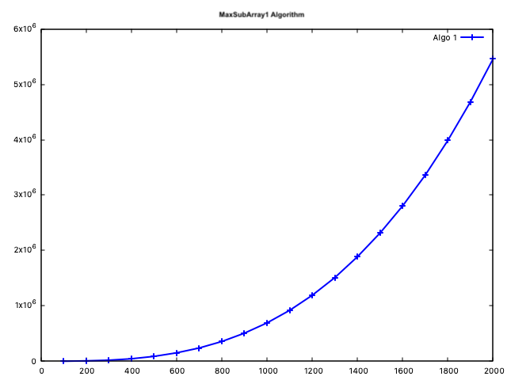
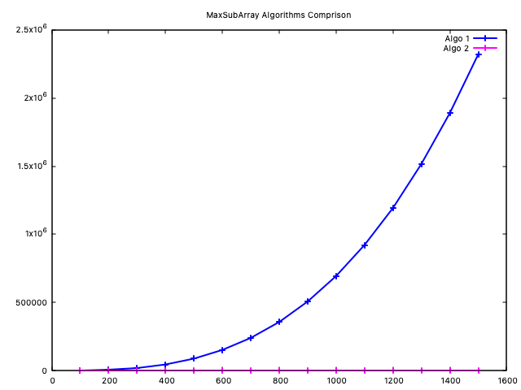
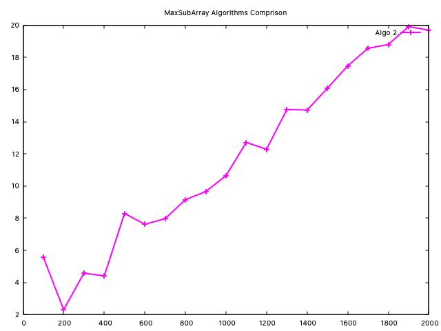

# TP2 Vasileios Skarleas et Yanis Sadoun

## Exercice 1

### Q1-1 Algorithm et complexité

On initialise min et max comme etant le premier element du tableau et aprés on va parcourir le reste du tableau (ca veut dire n-1 elements) tout en comparant chaque element par rapport le min et le max de base. Si les conditions sont corrects, le min ou le max c'est mis à jour chaque fois qu'on se tombe dans ce cas.

La complexité de l'agorithm est O(2 * (n-1)). Plus precisement:

```c
void get_min_max_1(int *tab, int n, int *min, int *max)
{
    int max_local = tab[0]; //O(1)
    int min_local = tab[0]; //O(1)

    for (int i = 1; i < n; i++) // (n-1) x  3*O(1) [car il fait deux comparaisons et en pire des cas il va metre à jour le min_local ou le max_local]
    {
        if (tab[i] < min_local) //O(1)
        {
            min_local = tab[i]; //O(1)
        }
        else if (tab[i] > max_local) //O(1)
        {
            max_local = tab[i]; //O(1)
        }
    }
    *min = min_local; //O(1)
    *max = max_local; //O(1)
}
```

Ainsi, la complexité totale est O(3 * (n-1)) ou encore O(2 * (n-1)) qui s'implifie à O(n). La difference entre O(2 * (n-1)) et O(3 * (n-1)) est une constante qui est negligable. On peut avoir exactement une comlexite de O(2 * (n-1)) si on avait:

```c
if (tab[i] < min_local) //O(1)
{
min_local = tab[i]; //O(1)
}
else
{
max_local = tab[i]; //O(1)
}
```

### Q1-2 Algorithm et complexité

Chaque appel recursive va diviser le probleme en 2 sous-problemes. Alors, déja ce comportment ici a une complexité de O(log(n)). Dans le partie de comparaison, soit on est dans une cas de base (1 element), soit on compare deux elements et on reviens à la division qui etait avant.

Ainsi si on aura O(3 * log(n)) pour les appels recursives totals et O(n - 2) pour la comparaison de deux elements si c'est  une puissance de 2. Pour conclure au total on a O(3 * log(n)) + O((n - 2)) qui equivaut à O((3/2)n - 2) car log(n) < n.

```c
void get_min_max_rec(int *tab, int from, int to, int *min, int *max)
{
    if (from == to)
    {
        // Base case: single element
        *min = *max = tab[from];
    }
    else if (from < to - 1)
    {
        int mid = (from + to) / 2;
        get_min_max_rec(tab, from, mid, min, max);
        get_min_max_rec(tab, mid + 1, to, min, max);
    }
    else
    { // Handle two elements
        if (tab[from] < tab[to])
        {
            *min = tab[from];
            *max = tab[to];
        }
        else
        {
            *min = tab[to];
            *max = tab[from];
        }
    }
}

void get_min_max_2(int *tab, int n, int *min, int *max)
{
    *min = INT_MIN;
    *max = INT_MAX;
    get_min_max_rec(tab, 0, n - 1, min, max);
}
```

### Q1-3 Comparaison et conclusions


On constate que l'agorithm get_min_max_1 est plus efficace que get_min_max_2. L'explication est assez simple.

`get_min_max_1` parcourt le tableau une fois, effectuant des comparaisons et des affectations à temps constant. Sa complexité est O(n), ce qui le rend efficace pour des ensembles de données plus petits grâce à son approche simple et directe.

D'autre côtè, `get_min_max_2` divise récursivement le problème en sous-problèmes plus petits, conduisant à une complexité logarithmique (O(log n)). Cependant, cela implique également des appels de fonctions, un changement de contexte et des comparaisons supplémentaires dans le cas de base, ce qui peut ajouter une surcharge pour les ensembles de données plus petits.

Ainsi, le recapitulatif de nos resultats est:

| Algorithm         | Complexité | Avantages                                                          | Inconvenients                                           |
| ----------------- | ----------- | ------------------------------------------------------------------ | ------------------------------------------------------- |
| `get_min_max_1` | O(n)        | Simple, efficace pour les petits ensembles de données             | Peut être lent pour les grands ensembles de données   |
| `get_min_max_2` | O(log n)    | Asymptotiquement plus rapide pour les grands ensembles de données | Plus de surcharge pour les petits ensembles de données |

Pour les très grands ensembles de données (> 10 000 éléments), l'approche diviser pour régner de `get_min_max_2` pourrait surpasser `get_min_max_1` en raison de sa complexité asymptotique moindre. Cependant, `get_min_max_2` peut utiliser un peu plus de mémoire en raison de la surcharge de la pile de récursion.

## Exercice 2

### Q2-1 Algorithme, complexité et temps

Le codage de l'agorithme de sous-tableau de poids maximum est le suivant:

```c
int maxSubArraySum1(int *tab, int n)
{
   int max;
   get_max(tab, n, &max);
   int temp = 0;
   for (int i = 0; i < n; i++)
   {
      for (int j = i; j < n; j++)
      {
         for (int k = i; k <= j; k++)
         {
            temp = temp + tab[k];
         }
         if (temp > max)
         {
            max = temp;
         }
      }
   }
   
   return max;
}
```

Il s'agit d'un algorithme de complexéte O(n^3) car au pire des cas, on aura trois boucles imbriques de n elements. Ainsi on parle de n * n * n = n^3. La courbe du temps par rapport la taille du tableau est bien une courbe de n^3. On test pour un minimum des elements car on arrive déja à très grands nombres pour de taille assez petits. 



### Q2-2 Invariant Θ(n^2)

Selon la théorie mathematique, la meileur solution est celui de Kadane. L'algorithm proposé par le matécien est (notre invariant):

```
def max_subarray(numbers):
    """Find the largest sum of any contiguous subarray."""
    best_sum = - infinity
    current_sum = 0
    for x in numbers:
        current_sum = max(x, current_sum + x)
        best_sum = max(best_sum, current_sum)
    return best_sum
```

En effet, si l'élément actuel en question est supérieur à la somme actuelle du sous-tableau (max_current sur le code), alors il est préférable de démarrer un "nouveau" sous-tableau avec tab[i] comme seul élément (il est déja le plus grand dasn ce cas là).

D'un premier point de vue, l'algorithme s'emble d'avoit une comlexité O(n). Mais il y a une propabilité qu'il ne serait pas lineair pour chaque table possible. Par contre on sait que son majorant est Θ(n^2).

| MaxSumArray1 vs MaxSumArray2                   | MaxSumArray2                                   |
| ---------------------------------------------- | ---------------------------------------------- |
|  |  |

On constate comme même que les valeurs du temps ne sont pas très précis.
