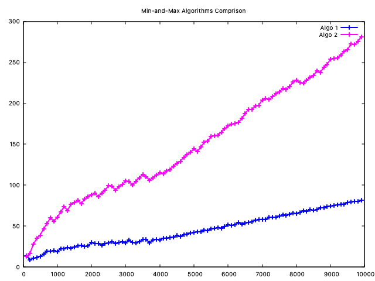
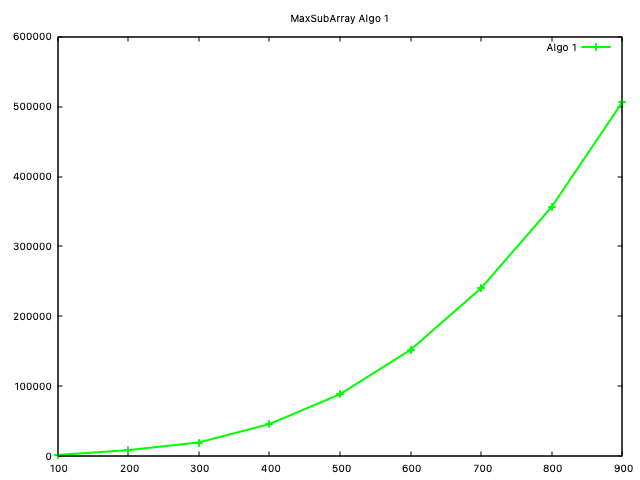
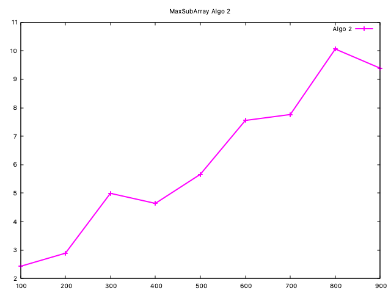
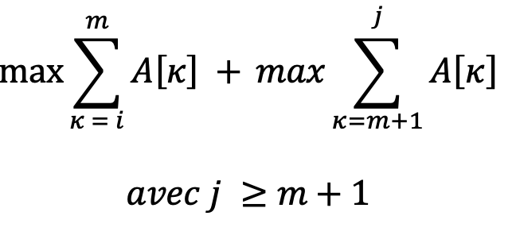
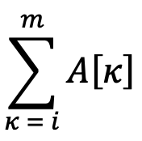
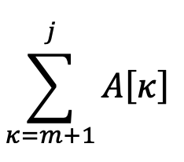
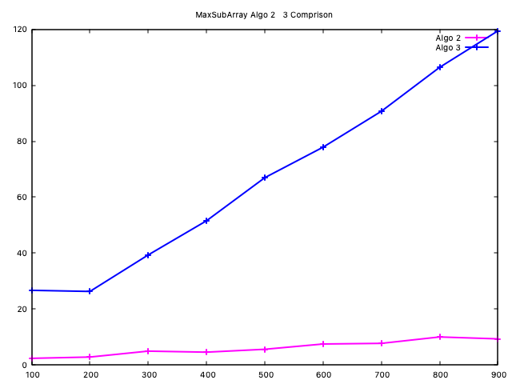
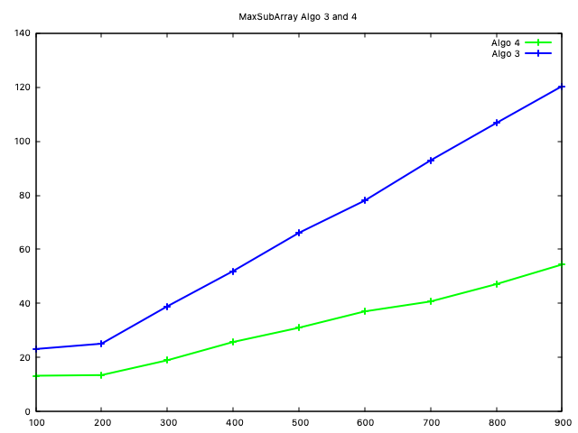
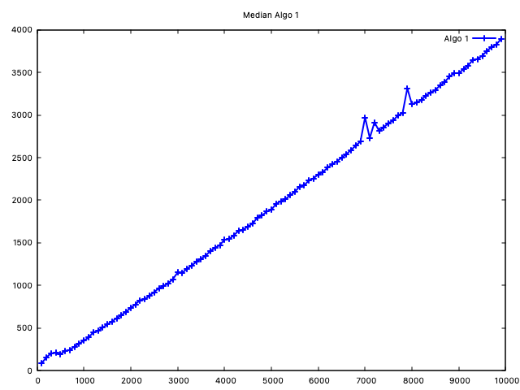
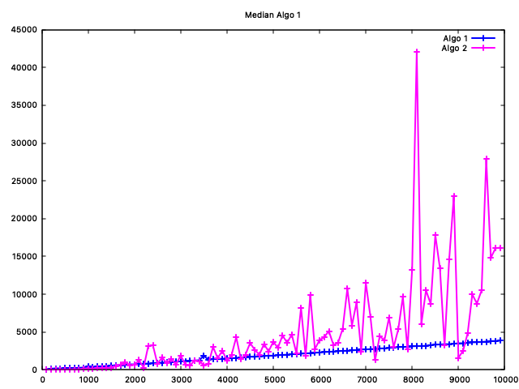

# TP2 Vasileios Skarleas et Yanis Sadoun

## Exercice 1

### Q1-1 Algorithm et complexité

On initialise min et max comme etant le premier element du tableau et aprés on va parcourir le reste du tableau (ca veut dire n-1 elements) tout en comparant chaque element par rapport le min et le max de base. Si les conditions sont corrects, le min ou le max c'est mis à jour chaque fois qu'on se tombe dans ce cas.

La complexité de l'agorithm est O(2 * (n-1)). Plus precisement:

```c
void get_min_max_1(int *tab, int n, int *min, int *max)
{
    int max_local = tab[0]; //O(1)
    int min_local = tab[0]; //O(1)

    for (int i = 1; i < n; i++) // (n-1) x  3*O(1) [car il fait deux comparaisons et en pire des cas il va metre à jour le min_local ou le max_local]
    {
        if (tab[i] < min_local) //O(1)
        {
            min_local = tab[i]; //O(1)
        }
        else if (tab[i] > max_local) //O(1)
        {
            max_local = tab[i]; //O(1)
        }
    }
    *min = min_local; //O(1)
    *max = max_local; //O(1)
}
```

Ainsi, la complexité totale est O(3 * (n-1)) ou encore O(2 * (n-1)) qui s'implifie à O(n). La difference entre O(2 * (n-1)) et O(3 * (n-1)) est une constante qui est negligable. On peut avoir exactement une comlexite de O(2 * (n-1)) si on avait:

```c
if (tab[i] < min_local) //O(1)
{
min_local = tab[i]; //O(1)
}
else
{
max_local = tab[i]; //O(1)
}
```

### Q1-2 Algorithm et complexité

Chaque appel recursive va diviser le probleme en 2 sous-problemes. Alors, déja ce comportment ici a une complexité de O(log(n)). Dans le partie de comparaison, soit on est dans une cas de base (1 element), soit on compare deux elements et on reviens à la division qui etait avant.

Ainsi si on aura O(3 * log(n)) pour les appels recursives totals et O(n - 2) pour la comparaison de deux elements si c'est  une puissance de 2. Pour conclure au total on a O(3 * log(n)) + O((n - 2)) qui equivaut à O((3/2)n - 2) car log(n) < n.

```c
void get_min_max_rec(int *tab, int from, int to, int *min, int *max)
{
    if (from == to)
    {
        // Base case: single element
        *min = *max = tab[from];
    }
    else if (from < to - 1)
    {
        int mid = (from + to) / 2;
        get_min_max_rec(tab, from, mid, min, max);
        get_min_max_rec(tab, mid + 1, to, min, max);
    }
    else
    { // Handle two elements
        if (tab[from] < tab[to])
        {
            *min = tab[from];
            *max = tab[to];
        }
        else
        {
            *min = tab[to];
            *max = tab[from];
        }
    }
}

void get_min_max_2(int *tab, int n, int *min, int *max)
{
    *min = INT_MIN;
    *max = INT_MAX;
    get_min_max_rec(tab, 0, n - 1, min, max);
}
```

### Q1-3 Comparaison et conclusions



On constate que l'agorithm get_min_max_1 est plus efficace que get_min_max_2 - qui n'est pas très d'accord avec les complexités théoriques car ` 2n-1` > `(3/2)n - 2`. Mais c'est quoi l'explication ?

`get_min_max_1` parcourt le tableau une fois, effectuant des comparaisons et des affectations à temps constant. Sa complexité est O(n), ce qui le rend efficace pour des ensembles de données plus petits grâce à son approche simple et directe.

D'autre côtè, `get_min_max_2` divise récursivement le problème en sous-problèmes plus petits, conduisant à une complexité logarithmique (O(log n)). Cependant, cela implique également des appels de fonctions, un changement de contexte et des comparaisons supplémentaires dans le cas de base, ce qui peut ajouter une surcharge pour les ensembles de données plus petits.

Ainsi, le recapitulatif de nos resultats est:

| Algorithm         | Complexité | Avantages                                                          | Inconvenients                                           |
| ----------------- | ----------- | ------------------------------------------------------------------ | ------------------------------------------------------- |
| `get_min_max_1` | O(n)        | Simple, efficace pour les petits ensembles de données             | Peut être lent pour les grands ensembles de données   |
| `get_min_max_2` | O(log n)    | Asymptotiquement plus rapide pour les grands ensembles de données | Plus de surcharge pour les petits ensembles de données |

Pour les très grands ensembles de données (> 10 000 éléments), l'approche diviser pour régner de `get_min_max_2` pourrait surpasser `get_min_max_1` en raison de sa complexité asymptotique moindre. Cependant, `get_min_max_2` peut utiliser un peu plus de mémoire en raison de la surcharge de la pile de récursion.

## Exercice 2

### Q2-1 Algorithme, complexité et temps

Le codage de l'agorithme de sous-tableau de poids maximum est le suivant:

```c
int maxSubArraySum1(int *tab, int n)
{
   int max;
   get_max(tab, n, &max);
   int temp = 0;
   for (int i = 0; i < n; i++)
   {
      for (int j = i; j < n; j++)
      {
         for (int k = i; k <= j; k++)
         {
            temp = temp + tab[k];
         }
         if (temp > max)
         {
            max = temp;
         }
      }
   }
   
   return max;
}
```

Il s'agit d'un algorithme de complexéte O(n^3) car au pire des cas, on aura trois boucles imbriques de n elements. Ainsi on parle de n * n * n = n^3. La courbe du temps par rapport la taille du tableau est bien une courbe de n^3. On test pour un minimum des elements car on arrive déja à très grands nombres pour de taille assez petits.



### Q2-2 Invariant Θ(n^2)

Selon la théorie mathematique, la meileur solution est celui de Kadane. L'algorithm proposé par le mathematicien est (notre invariant):

```
def max_subarray(numbers):
    """Find the largest sum of any contiguous subarray."""
    best_sum = - infinity
    current_sum = 0
    for x in numbers:
        current_sum = max(x, current_sum + x)
        best_sum = max(best_sum, current_sum)
    return best_sum
```

En effet, si l'élément actuel en question est supérieur à la somme actuelle du sous-tableau (max_current sur le code), alors il est préférable de démarrer un "nouveau" sous-tableau avec tab[i] comme seul élément (il est déja le plus grand dasn ce cas là).

D'un premier point de vue, l'algorithme semble d'avoir une comlexité O(n). Mais il y a une propabilité qu'il ne serait pas lineair pour chaque table possible. Par contre on sait que son majorant est Θ(n^2).

| MaxSumArray1 vs MaxSumArray2                   | MaxSumArray2                                   |
| ---------------------------------------------- | ---------------------------------------------- |
|  |  |

On constate comme même que les valeurs du temps ne sont pas très précis.

### Q2-3 Calculant stm3 en Θ(n)

Pour ce problème on veut faire une divison du tableau, alors mathematiquement stm3 est egal:



En general il faut prendre un tableau et  le diviser en deux parties, A1 et A2, au milieu. stm1 est le partie à gauche, stm2 est le partie droit et stm3 va inclure les elements centrés. On va resoudre le probleme recursivement pour stm1 et stm2 (les deux sous-tableaux), ce qui nous donne max1 et max2 respectivement. Derniere etape est la "fusion" des resultats: on cherche le max entre max1, max2, et stm3. Le resultat sera la somme maximale du sous-tableau pour le tableau combiné.

#### Complexité

On calcule  avec une boucle en Θ(n). De plus, on calcule  avec une boucle en Θ(n).  On somme les deux resultats. stm(A) = max{max1, max2, stm3}. La compelxite de fusion est donc lie au calcul de stm3 qui ce fait en Θ(n).

### Q2-4

Selon la question precedent, on propose l'agorithm suivante:

1. On divise le tableau dans 2 sous-tableaux (left and right). Il s'agit d'une appel recursive ayant comme cas de base: tableau d'un seule element retourne cet element comme son maximum.
2. On calcule le stm3 qui calcule le maximum de sous-tableau gauche et droit
3. On fait une comparaison de maximume ntre stm1, stm2, stm3

#### Complexité

En combinant ces deux parties, la complexité totale de l'algorithme est déterminée par le produit du nombre de niveaux de récursion et du coût de chaque opération de fusion. Puisque l'algorithme réalise une opération de fusion linéaire O(n) à chaque niveau de récursion et qu'il y a O(log n) niveaux, la complexité totale de l'algorithme est O(n log n).

Le theoreme maitre nous donne:

`T(n) = 2T(n/2) + O(n)` avec a = 2, b = 2 et d = 1 => O(n log(n))



En comparant les deux algorithms, on constate que algo2 est plus efficace que algo3 pour ce nombre d'itterations. En effet, algo2 a une complexite de O(n) et algo3 une compelxité O(n log(n)) tels que n < n log(n).

### Q2-5

Ca serait faux, car on peut avoir:

pref(A1) =/= pref(A) et suff(A2) =/= suff(A). Un tel exemple est pour un tableau `1 -2 3 -1 ` avec A1 = {1,-2} et A2 = {3, -1}. AInsi pref(A1) = 1 et pref(A2) = 3 et pref(A) = 3. Donc on est biens dans le cas de pref(A1) =/= pref(A).

### Q2-6

#### Formule

La formule de trouver le quadruplet est le suivant:

(**max{stm1, stm2, suff1 + pref2}** , *max{pref1, tota1 + pref2}*, max{suff2, suff1 + tota2}, tota1 + tota2). De plus on remarque que la compelxité de cette operation est Θ(1).

#### Complexité

D'apres le theorem de maitre on a:

`T(n) = 2T(n/2) + Θ(1) `car tous les operations de comparison qui sont effectués sur maxSubArraySumRec2 sont de complexité O(1). Ainsi a = 2, b = 2 and n = 0;

Ainsi la complexité est Θ(n) selon le theoreme toujours.



Selon les resultats obtenu par la comparaiosn, l'agorithm4 (complexité Θ(n)) est plus efficace que l'gorithme3 (complexite O(n log(n))). Les resulatst theoriques sont verifiés experimantelment. 

## Exercice 3

### Q3-1 Médian en utilisant tri fusion

L'agorithme est assez simple:

```c
void median(int *tab, int n)
{
    tri_fusion(tab, n); //O(n log(n))
    if (n % 2 == 0) //O(1)
    {
        printf("Median number are: %d and %d\n", tab[(n/2)-1], tab[n/2]); //O(1)
    }
    else
    {
        printf("Median number is: %d\n", tab[n/2]); //O(1)
    }
}
```

Alors sa complexéte est O(n log(n)) et a courbe de l'exécution est la suivante:



### Q3-2

Il faut trouver l'agorithme selon les specifications suivantes:

> Développer une méthode de type diviser pour régner pour ce problème.
> Soit selection(S,k) la fonction qui sélectionne le keme plus petit élément de S. Pour ce faire, on
> utilise un élément pivot v du tableau en fonction duquel on partitionne S en trois sous-ensembles :
> le sous-ensemble SG des éléments plus petits que v, le sous-ensemble Sv des éléments égaux à v et le
> sous-ensemble SD des éléments plus grands que v. Si |SG| < k ≤ |SG| + |Sv| alors v est le keme plus
> petit élément de S. Identifier l’appel récursif à réaliser après partition de S en SG, Sv et SD.

Du coup, on propose l'agorithme suivante:

```
fonction median_2 
	Entree: un tablau des entier et sa longueur
	Sortie: le median du tableau

si longeur = 0 alors
	median N'EXISTE PAS (NILL)
sinon
	si n est impair alors
		retourner smallest_k(tableau, 0, n-1, n/2)
	sinon
		retourner (smallest_k(tableau, 0, n-1, n/2) + smallest_k(tableau, 0, n-1, n/2+1))
	finsi
finsi

## Basé sur l'idée clasique qui si l'echantilon (trié) est un nombre impair, alors le median est l'element en centre et dans le cas d'une logueur pair c'est lamoyenne de deux nombres centrés.

fonction smallest_k
	Entree: un tableau des entiers, debut et fin de traitment de sous-tableau de tableau original, ainsi qu'un nombre k. 
	Sortie: Retourner le kieme plus petit element de sous-tableau [debut, ... , fin].

si debut = fin
alors
	retourner tableau[debut] ## Il y a un seul element sur le tableau donce effectivement il va etre le kieme element le plus petit. 
finsi

position_de_pivot <- pivot_division(tableau, debut, fin)

si k = position_pivot - debut alors
	retourner tableau[position_de_pivot] #kieme element le plus petit trouvé
sinon si k < position_pivot - debut alors
	retourner smallest_k(tableau, debut,position_de_pivot - 1, k) #le kieme element le plus petit n'est pas encire trouvé mais il va être à gauce
sinon
	retourner smallest_k(tableau,position_de_pivot- 1, fin, k - position_pivot +debut) #le kieme element va être à gauce
finsi

```

pivot_division ici choisi un pivot aleartoirement tout en partionant le sous-tableau du tableau orginal selon les instructions du sujet.

Cet algorithme est inspiré par le cours CS125 Fall 2016 - Unite 4 - Prof.  Jelani Nelson at Harvard University (source: https://people.seas.harvard.edu/~cs125/fall16/lec4.pdf).

La complexité de l'agorithm est entre O(n) et O(n^2). Bein verifié par les resultats de la graphe:



## Exercice 4

Le code pour resoudre le puzzle "Shadows of the Knight" is:

```c
#include <stdbool.h>
#include <stdio.h>
#include <stdlib.h>
#include <string.h>

/**
 * Auto-generated code below aims at helping you parse
 * the standard input according to the problem statement.
 **/

int main() {
  // width of the building.
  int W;
  // height of the building.
  int H;
  scanf("%d%d", &W, &H);
  // maximum number of turns before game over.
  int N;
  scanf("%d", &N);
  int X0;
  int Y0;
  scanf("%d%d", &X0, &Y0);

  int x1 = 0;
  int y1 = 0;
  int x2 = W - 1;
  int y2 = H - 1;

  // game loop
  while (1) {
    // the direction of the bombs from batman's current location (U, UR, R, DR,
    // D, DL, L or UL)
    char bomb_dir[4];
    scanf("%s", bomb_dir);

    bomb_dir[strcspn(bomb_dir, "\n")] = '\0';

    if (strcspn(bomb_dir, "U") != strlen(bomb_dir))
    {
        y2 = Y0 - 1;
    }
    else if (strcspn(bomb_dir, "D") != strlen(bomb_dir))
    {
        y1 = Y0 + 1;
    }

    if (strcspn(bomb_dir, "L") != strlen(bomb_dir))
    {
        x2 = X0 - 1;
    }
    else if (strcspn(bomb_dir, "R") != strlen(bomb_dir))
    {
        x1 = X0 + 1;
    }

    X0 = x1 + (x2 - x1) / 2;
    Y0 = y1 + (y2 - y1) / 2;

    // the location of the next window Batman should jump to.
    printf("%d %d\n", X0, Y0);
  }

  return 0;
}
```

On a cree deux couples (x1, y1) et (x2, y2) qui nous donne le diagonal de sous-2Dtableau sur laquel on chercher chaque fois. On cherche si sur la phrase lu existe "U", "D", "L", "R" et on fait les deplacemnets des coordonnes necesaires. Derniere etape est de mettre à jour les coordonnes du caracter qui sont controllés par les variables (x0, y0).

| Phrase | x   | y   |
| ------ | --- | --- |
| U      |     | y-- |
| D      |     | y++ |
| L      | x-- |     |
| R      | x++ |     |
