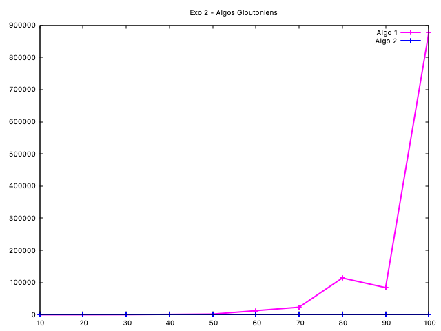
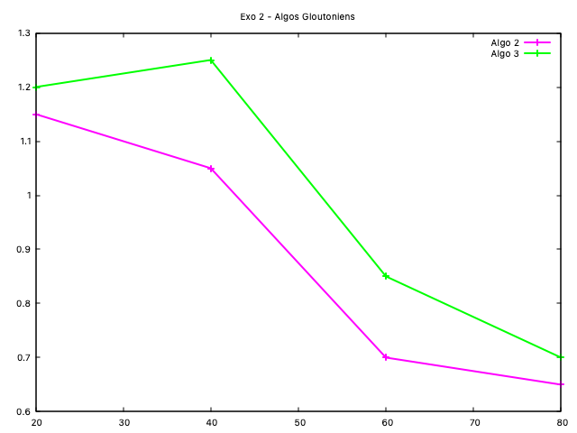
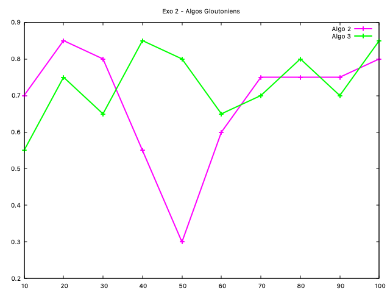
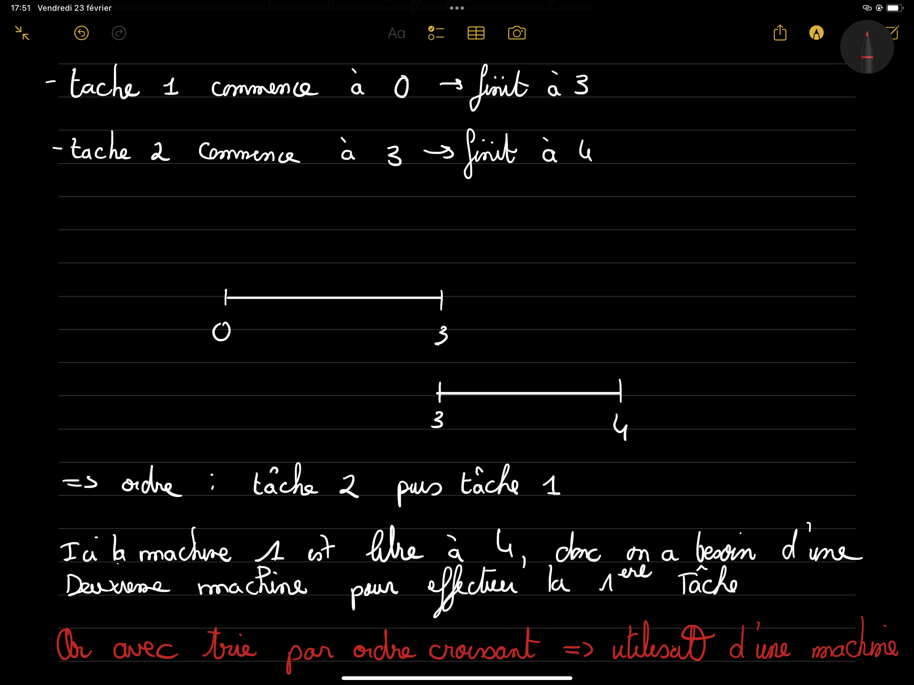
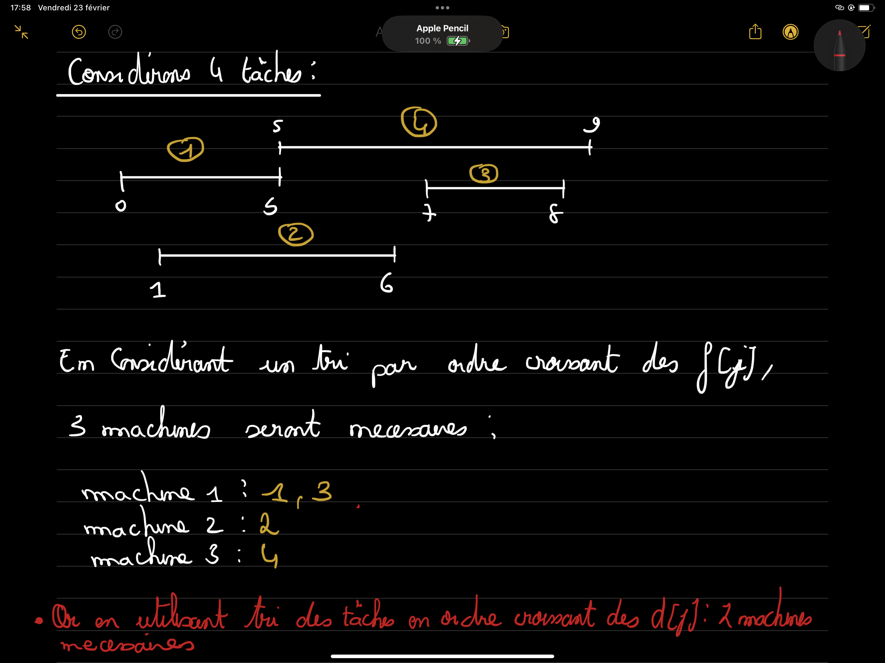
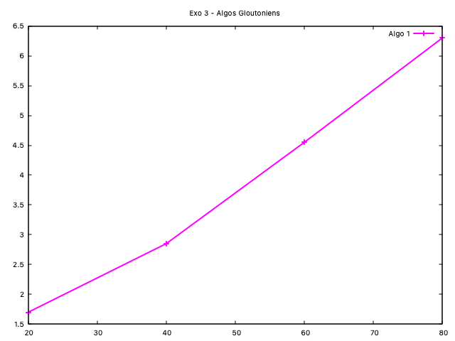

# TP3 Vasileios Skarleas et Yanis Sadoun

## Exercice 1

Voici le code pour cet exercice :

```c
void generate_instances(int *debut, int *fin, int n, int Fmax){
  for (int i = 0; i < n; ++i)
  {
    debut[i] = nb_random(0, Fmax); //taking any number on the intervalle
    fin[i] = debut[i] + nb_random(1, Fmax - debut[i]); //starting from the beginning of the interval we add minimum 1 up to maximum - start time (in order to remain on the Fmax limit)
  }
}
```

L'agorithme est le suivant:

```
tant que i de 1 à n
	début[i] <- nombre_aléatoire(0 à max)
	fin[i] <- debut[i] + nombre_aléatoire(1, nouveau_max)
```

La condition de nouveau max est d'être inferieure ou egale à max.

La compléxité de ce code peut être analysé comme suit : 

La fonction génère des instances pour un problème d'ordonnancement en assignant aléatoirement des dates de début et de fin à n tâches, avec certaines contraintes.

* La boucle for itère n fois, où n est le nombre de tâches.
*  debut[i] = nb_random(0, Fmax) génére un nombre aléatoire pour la date de début de la tâche. Cette opération est considérée comme 
O(1), une opération en temps constant.
* fin[i] = debut[i] + nb_random(1, Fmax - debut[i]); : Génére un autre nombre aléatoire pour la durée de la tâche et l'ajouter à la date de début pour obtenir la date de fin. Cette opération est également O(1).

Par conséquent, la complexité de generate_instances est O(n), où n est le nombre de tâches à générer. 


## Exercice 2

### Q1

La compléxité du code de calcule_optimale mentioné sur le sujet du TP peut être analysée comme suit:

* On constate que pour chaque tâche j, l'algorithme parcourt toutes les tâches précédentes (de 0 à `j-1`) pour trouver la dernière tâche compatible. Le pire des cas est O(j).
* L'algorithme fait deux appels récursifs : un pour le cas der_j et un autre pour le cas où la tâche j n'est pas incluse.

Par conséquent , la compléxité  de cet algorithme esst exponentielle, plus précisement en O(2^n) où n est le nombre total de tâches.

Nota bene:En pratique, cet algorithme peut devenir très lent pour un nombre relativement faibles de tâches, etant donné que le nombre total d'opérations augmente très rapidement à mesure que le nombre de tâches augmente . C'est d'ailleurs ce qui est visible sur le graphe ci-dessous.

```c
int calcule_OPT(int *deb, int *fin, int j)
{
    if (j < 0) // O(1)
    {
        return 0;
    }
    else
    {
        int der_j = -1; //O(1)
        // Trouver la dernière tâche compatible avec la tâche j
        for (int i = 0; i < j; i++) // j * O(1) = O(j)
        {
            if (is_compatible(i, j, deb, fin)) // O(1)
            {
                der_j = i; // O(1)
            }
        }

        // Calculer récursivement l'OPT en incluant ou excluant la tâche j
        return max(1 + calcule_OPT(deb, fin, der_j), calcule_OPT(deb, fin, j - 1)); 
    }
}
```




### Q2

La complexité de l'algorithme `calcule_OPT_glouton` est \(O(n)\). En effet, l'algorithme contient principalement une boucle `for` qui itère sur l'ensemble des tâches, allant de 0 à `nbTaches - 1`. À l'intérieur de cette boucle, toutes les opérations effectuées, sont en temps constant, c'est-à-dire O(1). Puisque ces opérations en temps constant sont répétées pour chaque tâche, la complexité globale de l'algorithme est dominée par le nombre d'itérations de la boucle, qui est proportionnel au nombre de tâches `n`. 

Dès lors , la complexité totale est en O(n) (linéaire par rapport à `n`).

```c
int calcule_OPT_glouton(int *deb, int *fin, int nbTaches)
{
    int dispo = 0; // O(1)
    int k = 0; // O(1)

    for (int j = 0; j < nbTaches; j++) // n * 3*O(1) = O(n)
    {
        if (deb[j] >= dispo) // O(1)
        {
            k++; // O(1)
            dispo = fin[j]; // O(1)
        }
    }
    return k; // O(1)
} => O(total) = 3 * O(1) + O(n) = O(n)
```

### Q3

L'algorithme récursif de la question 1, montre une complexité qui croît rapidement avec la taille de l'entrée, comme en témoigne le tracé rose sur le graphe, qui indique une augmentation exponentielle du temps d'exécution. En revanche, l'Algorithme 2, qui est une approche gloutonne, présente une complexité linéaire O(n), ce qui se traduit par un temps d'exécution beaucoup plus court, à peine visible sur le graphe et représenté en bleu. Ce contraste marque l'efficacité supérieure de l'algorithme glouton par rapport à l'approche récursive pour ce problème spécifique.

### Q4

Basé sur l'algorithme de la question 2, maintenant on cree un tablau statique qui s'appelle tacheSelected surlequel on sauvegarde  pour chaque position si la machine peut accepter un tache quand il n'y a pas un chevauchment. C'est juste le sauvegrade d'une information de plus qui n'est pas utilisé sur la logique de décision de l'agorithme glouton. La complexité est toujours O(n).

On obtiens le graphe suivant:





On constate que même si les deux algorithmes ont la meme complexité, on n'obtiens pas les mêmes resultats. C'est un très bon exemple d'observer comment une ligne du code de complexité O(1) peut impacter (pas beaucoup) le comportment du code globalment.

#### Nota bene

On remarque qu'on ne distingue pas très clairment la complexite de O(n) sur la graphe car on n'a pas pris un grand nombre des nmbre des sequences pour faire les tests parce que l'appelle de fonction est la meme avec celle qui appele la question 1 qui a une compelxite de O(2^n) - il prend beaucoup de temps pour executer.

## Exercise 3

### Q1

Il est tres important d'essayer diminuer le nombre des machines qui sont utilisé à chaque moment. Pour decider entre les trois propositions de triage, on considere que les taches en question sont trié en ordre corissant. La methode le plus efficace est celle de triage en ordre coissante de d[j]. Ca veut dire d'ordre croissante selon le debut de chaque tache. 

On propose le deux contre exemples ci-dessous qui nous permet à conclure.

#### Trier les taches en ordre croissant de f[j] - d[j]



#### Trier les taches en ordre croissant de f[j]



### Q2

#### Algorithme

On definit profondeur d'un ensemble d'intervalles ouverts le nombre maximum contenant une instance de temps. Alors, ici on a comme condition necesaire que: `nb_machines_besoin >= profondeur`. Pour calculer le profondeur, on tri les tableaux selon le triage en ordre croissante de f[j]. Après on applique l'algorithme suivante:

```c
tri_selon_le_fin(deb, nbTaches)
tri_selon_le_fin(fin, nbTaches)
depth <- 0 //Initialisation du profondeur à zero selon la du profondeur

tant que i < nbTaches & j < nbTaches
    si deb[i] < fin[j] alors
    	p <- p +1
    	i <- i +1
    sinon
    	j <- j +1
    fin si

    depth <- max(p, depth)
fin tant que
retourner depth
```

#### Compelxité

La complexité d'algorithme est de O(n) parce que le pire de cas possible est de parcourir jusque nbTcahes = n. Il y a un 'et logique' sur la condition qui control la boucle while [sur le code] et on fait on ne peut pas avoir plus que n itterations.



### Q3

On a testé deux exemples fait à la main qui etaient les suivantes:

* Exemple 1

  * int deb1[]= {1, 2, 4, 6, 8};
  * int fin1[]= {3, 5, 7, 9, 10};
* Exemple 2

  * int deb2[]= {1, 3, 0, 5, 8, 5};
  * int fin2[]= {2, 4, 6, 7, 9, 9};

Dans le deux cas on obtiens les memes resultats (2 pour le premier et 3 pour le deuxieme)

## Exercise 4

```c
#include <stdio.h>
#include <stdlib.h>

int compare(const void *a, const void *b) {
    return *(int *)a - *(int *)b;
}

int main() {
    int N; // Nombre de Pilipius
    scanf("%d", &N);
    long long C; // Coût du cadeau
    scanf("%lld", &C);

    int budgets[N]; // Tableau pour stocker les budgets de chaque Pilipiu
    long long sum_of_budgets = 0; // Somme totale des budgets

    for (int i = 0; i < N; i++) {
        scanf("%d", &budgets[i]);
        sum_of_budgets += budgets[i];
    }

    if (sum_of_budgets < C) {
        printf("IMPOSSIBLE\n");
        return 0;
    }

    qsort(budgets, N, sizeof(int), compare); // Trier les budgets

    int contributions[N];
    long long remaining_cost = C;

    for (int i = 0; i < N; i++) {
        // Contribution calculée comme la part équitable ou le budget maximum, selon le plus petit
        long long equitable_share = remaining_cost / (N - i);
        contributions[i] = (budgets[i] < equitable_share) ? budgets[i] : equitable_share;
        remaining_cost -= contributions[i];
    }

    // Affichage des contributions
    for (int i = 0; i < N; i++) {
        printf("%d\n", contributions[i]);
    }

    return 0;
}
```


IL Y AUSSI UNE AUTRE VERSIONQUE J'AI FAIT. C'EST LE SUIVANT: https://share.icloud.com/photos/0ae5x__yUIGFreGZCe49VEmKA
J'AI PRIS DES PHOTOS PARCE QUE JE N'ETAIS PAS SUR MON ORDI. JE VA LE METTRE COMME VERSION 2 DEMAIN.

Ce code suit les étapes suivantes :

Lire le nombre de Pilipius et le coût du cadeau.
Lire les budgets de chaque Pilipiu, les additionner et les trier.
Si la somme des budgets est inférieure au coût du cadeau, afficher "IMPOSSIBLE".
Sinon, répartir le coût du cadeau parmi les Pilipius en commençant par le budget le plus bas, tout en s'assurant que chaque contribution est le plus petit entre le budget du Pilipiu et sa part équitable du coût restant.
Afficher les contributions de chaque Pilipiu.
Cette approche gloutonne vise à minimiser la contribution la plus élevée en attribuant d'abord le montant que chaque Pilipiu peut raisonnablement contribuer, compte tenu du budget restant et du nombre de Pilipius restants.

L'algorithme glouton que j'ai proposé pour le problème des Pilipius n'est pas nécessairement correct pour toutes les instances possibles.
 Le problème réside dans la manière dont l'algorithme répartit le coût du cadeau parmi les Pilipius.
 L'algorithme tente de minimiser la contribution la plus élevée en attribuant d'abord la contribution que chaque Pilipiu peut raisonnablement payer, compte tenu de son budget et du coût total restant.
  Cependant, cette approche ne garantit pas toujours que la solution trouvée soit optimale selon les critères énoncés, notamment :

La plus grande contribution est minimale.
Si plusieurs solutions optimales sont possibles, choisir celle où la deuxième plus grande contribution est minimale, et ainsi de suite.
